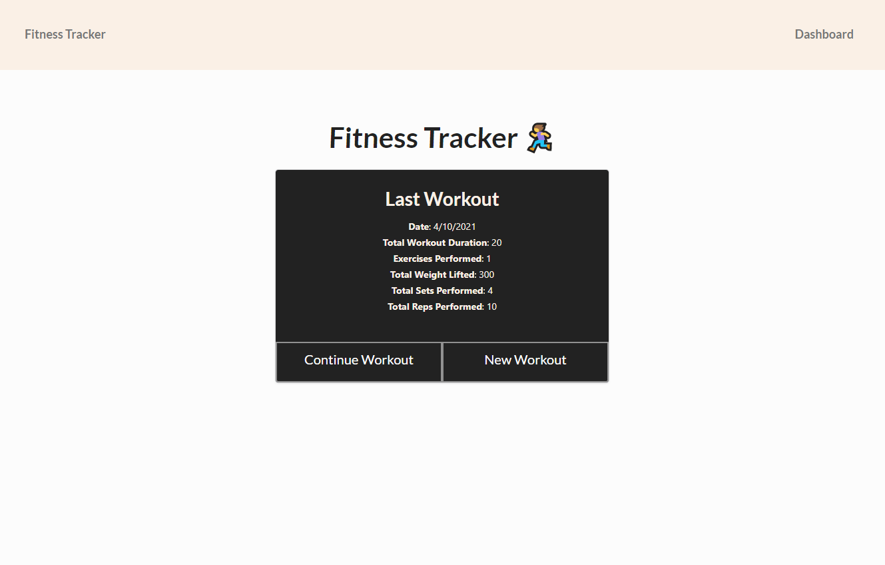
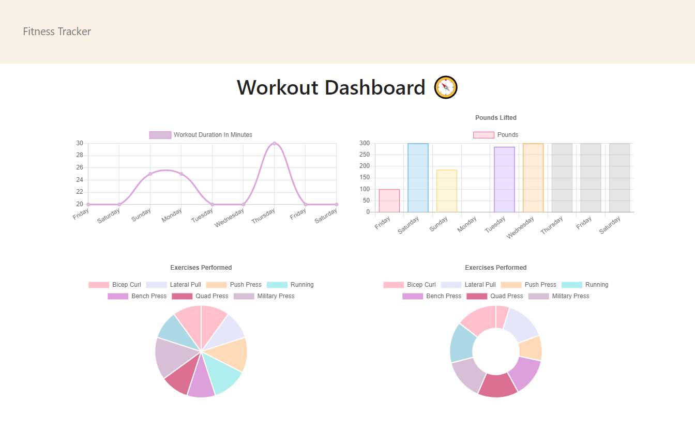

# MongoDB Fitness Tracker 🏃‍♀️

### This full-stack app uses Express and MongoDB to allow a user to view, create and track daily workouts.

## *Table of Contents*

- [Description](#description)
- [Installation](#installation)
- [Usage](#usage)
- [Screenshots](#screenshots)
- [Contact](#contact)

## *Description*

Using an Express backend and MongoDB database, this full-stack web application allows a user to view, create and track daily workouts. Users can reach their fitness goals more quickly when they have a customized dashboard to track their workout progress.

### 📍 [View on Heroku](https://katsign-fitness-tracker.herokuapp.com/) 📍

## *Installation*

### Navigate into the repository folder on your local machine and open the built-in terminal. You will need Node.js installed to run this application.

- On the command line, type `npm i` to pull the app's dependencies to your local.
- Start MongoDB and then type `npm run seed` in terminal to seed the collection.
- Type `npm start` to run the application locally.
- Navigate to `https://localhost:3000` in browser to view the development server.

## *Usage*

- Click `Continue Workout` to add to the most recent workout plan.
- Click `New Workout` to add a new workout plan to the database.
- To view progress charts and visuals, click `Dashboard` from the navbar.

## *Screenshots*

## *Contact*

🔗 Links in Bio @[katsign](https://github.com/katsign)

---
This project is MIT licensed. &copy; 2021